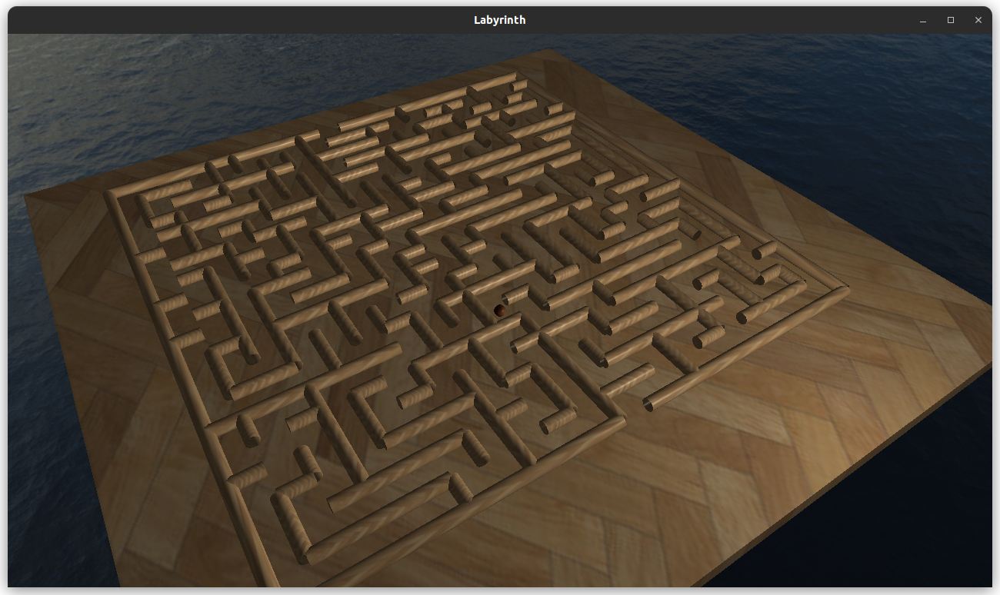

## The Labyrinth

A simple maze solving game

## How to Compile and Run

To compile and run the project:
1. Make sure you have the following libraries installed
    - GLFW - 3.3.8 (https://www.glfw.org/download.html)
    - GLad (https://glad.dav1d.de/)
    - GLM (https://github.com/g-truc/glm)
    - Assimp (https://github.com/assimp/assimp)
3. Clone this repository using `git clone https://github.com/Xzanam/TheGame.git`.
4. Navigate to the project directory: `cd TheGame/src`.
5. Compile the code using makefile
    ```make target=main```
7. Run the executable: `./main`.

## References
  De Vries, J. (2021). Learn OpenGL: Graphics Programming in C++. [Online Book]. https://learnopengl.com/

## Snapshots



